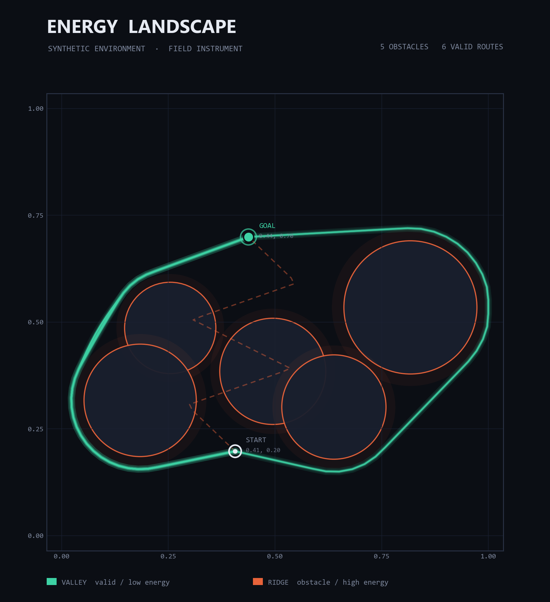

# Energy Landscape Visualizer

**A trajectory model that learns the landscape of every valid future, not a single averaged guess.**

[**Live demo →** blacktensor.github.io/ebm-energy-landscape](https://blacktensor.github.io/ebm-energy-landscape/)



---

## What it is

Most trajectory predictors regress to one path. When several routes are equally valid, that one answer is the *average* of them — a path that threads between the real options and matches none.

This project takes the energy-based approach instead. A network learns a scalar **energy** `E(scene, trajectory)`: low for plausible routes, high for bad ones. Training carves valleys into that landscape wherever valid trajectories live. To *generate* a path, **Langevin dynamics** starts from a random scribble and walks downhill in the energy —

```
path ← path − lr · ∇E(path) + noise
```

— until it settles into a valley. Because the landscape is multimodal, different random starts settle into different valleys, so one model produces many distinct valid routes for the same scene. The energy is trained by **denoising score matching** (perturb valid paths across a noise ladder, learn to point back), which gives a smooth, descendable field rather than isolated spikes.

The web app visualizes all of it: the live energy heatmap, trajectories animating from chaos into the valleys, the fan of distinct routes, and a side-by-side of regression's one averaged line against the EBM's many.

## Architecture

`E(scene, trajectory) → scalar`, three stages joined by an MLP head (**~458K parameters**):

| Stage | Component | Role |
|---|---|---|
| Map encoder | CNN | Rasterizes start / goal / obstacles to a multi-channel image, convolves to a scene embedding |
| Trajectory encoder | Bidirectional LSTM | Reads the ordered `(x, y)` points (with per-step velocity), pools to a sequence embedding |
| Energy head | MLP | Concatenates both embeddings, emits one scalar energy |

Design notes: **GroupNorm** (not BatchNorm) so single-sample Langevin evaluation never couples samples through batch statistics; **SiLU** activations for a smooth, jitter-free gradient to descend; the map branch carries no trajectory gradient since the scene is fixed conditioning.

## Results

- **Energy gap +2.606** between valid and bad trajectories — real, sustained separation, not collapsed.
- **Accuracy 0.806** ranking valid below bad.
- **8 distinct valid routes** sampled for a single scene (the multi-sample view).
- **9 distinct modes from 16 seeds** on the best scene — confirming the landscape is genuinely multimodal, the core claim of the project.

## Reproduce

Training runs end to end on **Google Colab's free GPU tier** — no paid compute, no local GPU. The code is device-agnostic (CUDA when present, CPU otherwise, same path).

```bash
git clone https://github.com/BlackTensor/ebm-energy-landscape.git
cd ebm-energy-landscape
pip install -r requirements.txt

python training/train.py      # synthesize data, train, write exports/energy_model.pt
python training/export.py     # write the JSON bundle (heatmap, scene, routes, descent) to exports/
```

Or open `training/notebook.ipynb` in Colab (`Runtime → Change runtime type → GPU`), then run top to bottom. Data is fully synthetic and generated in code — nothing to download.

Run the web app locally:

```bash
cd web
npm install
npm run dev
```

The app reads the exported JSON from `web/public/data/`.

## Tech stack

PyTorch · NumPy · React · Vite · GitHub Pages (CI-deployed to the `gh-pages` branch). Entirely free tooling, end to end.
